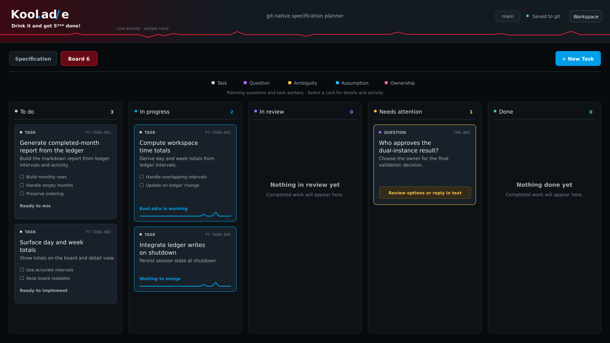

# Kool.ad/e

<div align="center">

### Drink it and get S*** done!

**A native desktop planning and execution layer for agentic software development.**

Turn vague ideas into living specifications, actionable tasks, verified code, and significantly fewer
*"wait... why did the agent do that?"* moments.



**Rust · Linux · Git-native · Agent-powered · Zero grams of sugar**

</div>

---

## Experimental software — use on a test repository

> **⚠️ Kool.ad/e isn’t fully mixed yet.**
>
> Kool.ad/e is under active development and has not been fully security- or reliability-vetted. **Do not use it on repositories, infrastructure, credentials, or projects you can’t afford to lose, corrupt, or expose.**
>
> For now, use disposable clones or test repositories, keep independent backups, review generated changes, and leave automatic publication disabled unless you knowingly accept the risk.
>
> The sandbox, Git worktrees, human approval gates, and verification checks reduce risk. They are not a guarantee against surprising behavior.
>
> **Drink responsibly. Code experimentally.**

---

## What is Kool.ad/e?

Kool.ad/e is a desktop application for planning and building software with AI coding agents.

You bring it an idea:

> "I want users to be able to save searches."

Kool.ad/e helps turn that into:

**Idea → Clarification → Living Spec → Approved Plan → Task Stories → Implementation → Verification → Review/Publish**

The important bit is everything in the middle.

Most coding agents are very good at writing code once they understand what they're supposed to build. Unfortunately, humans are exceptionally talented at saying things like:

> "Just add saved searches. It should be pretty straightforward."

Kool.ad/e lives in the gap between those two realities.

It teases out ambiguity, maintains the specification, tracks unanswered questions, decomposes approved work, coordinates coding agents, verifies their output, and keeps you in control of what actually gets built.

Basically, project management for people who would rather be writing software than project-managing software.

---

## Meet Kool.ad/e Man.ager

The main agent you interact with is **Kool.ad/e Man.ager**.

No relation.

Kool.ad/e Man.ager acts as the planning and coordination layer between you, your repository, and the coding agents doing the work.

Instead of throwing an entire product conversation into one enormous chat session and hoping everyone remembers what happened 80,000 tokens ago, Man.ager maintains durable project knowledge in your repository.

It can:

- interview you about a feature or project
- identify questions, ambiguities, assumptions, and ownership gaps
- maintain the living product specification
- recommend implementation approaches
- generate ordered implementation tasks
- coordinate implementation workers
- verify completed work
- surface blockers when human judgment is actually required

It is less "AI pair programmer" and more "slightly obsessive technical project manager who happens to have access to coding agents."

And unlike certain completely unrelated mascots from your childhood, Kool.ad/e Man.ager generally prefers **Git worktrees** to entering rooms through the wall.

---

## The board is the interface

Kool.ad/e doesn't revolve around one giant chat window.

The **Kanban board is the workspace**.

Questions, ambiguities, assumptions, planning work, implementation tasks, reviews, and blockers all live together as first-class items.

Each item gets its own focused conversation and context.

That means a discussion about database migrations doesn't quietly contaminate the context for a completely unrelated authentication task three days later.

Cards move through:

**To do → In progress → In review → Needs attention → Done**

When Kool.ad/e needs something from you, the question appears directly on the item that needs it.

Answer it there.

Continue drinking responsibly.

---

## Living specifications, not chat archaeology

Chat history is useful.

Chat history is also a terrible product specification.

Kool.ad/e maintains a **Git-backed living specification** describing the product as it exists now.

Specifications capture things such as:

- product overview
- users and desired outcomes
- current capabilities
- architecture and constraints
- important decisions
- quality and acceptance expectations

Changes are planned separately, reviewed, approved, implemented, and eventually reconciled back into the product specification.

Git keeps the history.

The specification keeps the truth.

This prevents the traditional agentic-development archaeology expedition:

> "I know we decided this somewhere around message 847..."

---

## Planning that actually ends

Planning should produce something buildable, not an indefinitely expanding conversation.

For a feature or new project, Kool.ad/e works toward a clear contract:

1. Understand the goal.
2. Identify missing information.
3. Resolve important ambiguity.
4. Define scope and exclusions.
5. Establish constraints and acceptance criteria.
6. Produce an implementation-ready specification.
7. Ask you whether it should proceed.

Nothing starts building simply because the agent became excited about its own plan.

You approve the plan first.

A revolutionary governance model.

---

## From specification to task stories

Once a specification is approved, Kool.ad/e can generate ordered implementation stories.

Each story contains the context needed to perform that piece of work, including:

- the problem being solved
- intended outcome
- affected areas
- implementation guidance
- dependencies
- acceptance criteria
- tests
- verification commands

Tasks are generated as durable Markdown artifacts in the repository.

For example:

```text
.koolade-packet/planning/tasks/saved-searches/
├── README.md
├── specification.md
├── 001-persist-named-search-filters.md
└── 002-build-the-saved-search-picker.md
```

Generation is resumable. Completed stories are preserved if generation is interrupted, and user-edited stories are not silently overwritten.

Because "the AI regenerated my ticket and deleted the part I fixed" is not a feature.

---

## Let the agents loose. Carefully.

Kool.ad/e can move beyond planning and coordinate implementation.

Approved tasks are executed in **isolated Git worktrees**, allowing multiple independent workers to operate concurrently without turning your working copy into a crime scene.

The worker pool is configurable from **1 to 8 concurrent tasks**, with **3** as the current default.

Dependencies are respected. Independent work can run concurrently, including planning or task generation while implementation workers continue. A task waiting for review or attention does not stop unrelated ready tasks from using the remaining worker capacity. Ready tasks that cannot start yet remain queued and the board reports when all worker slots are occupied.

Each task gets:

- its own worktree
- its own agent session
- implementation progress
- verification
- failure recovery
- preserved evidence
- independent cancellation

Failed work stays isolated.

Your main checkout stays yours.

---

## Human-gated autonomy

Kool.ad/e is designed to automate the tedious parts without quietly acquiring executive authority over your repository.

Planning, implementation, and publication are separate capabilities.

By default:

| Capability | Default |
| --- | --- |
| Planning assistance | ✅ |
| Automatic investigation | Configurable |
| Build approved work | ✅ |
| Publish verified changes | ❌ |
| Bypass failed verification because the agent seems confident | Absolutely not |

Generating tasks does **not** start implementation.

Approving a plan does **not** publish code.

Verified work can remain local for inspection until you decide what happens next.

When automatic publication is enabled, Kool.ad/e integrates work against the latest remote branch and reruns verification. The verified result stays local for your review until you choose **Share verified work**; sharing pushes a branch and opens a pull request.

No green checks, no share.

The robots have boundaries.

---

## Sandboxed agent execution

On Linux, autonomous repository access runs through **Bubblewrap**.

Planning and implementation sandboxes:

- scrub inherited environment variables
- hide host home and credential directories
- restrict repository access
- isolate network access
- prevent the agent from casually rummaging around the rest of your machine

Implementation happens in dedicated worktrees rather than your active checkout.

Kool.ad/e also uses locks around task execution and publication so multiple processes cannot casually race each other toward increasingly creative Git history.

If the required sandbox cannot be established, autonomous execution fails closed.

In technical terms: **no bubble, no trouble.**

---

## Verification is part of the job

Kool.ad/e doesn't consider "the agent said it works" to be a test strategy.

Implementation tasks carry explicit verification commands and acceptance criteria.

For Kool.ad/e itself, the current definition-of-done gates are:

```sh
cargo +1.98.1 fmt --all --check
cargo +1.98.1 test --locked --all-targets -- --test-threads=1
cargo +1.98.1 clippy --locked --all-targets -- -D warnings
```

Failed verification prevents publication.

Agents can attempt corrections and root-cause repairs, but they cannot simply explain why the failing test is probably unrelated and mark the task done anyway.

We've all met that developer.

---

## Agent activity you can actually see

Working items expose live activity so you can tell whether an agent is:

- thinking
- inspecting files
- running tools
- implementing
- verifying
- stuck
- contemplating the heat death of the universe while your local model processes a prompt

Kool.ad/e includes per-task activity views plus an aggregate activity graph across running work.

The graph represents observed agent activity, not fake precision about token throughput or productivity.

Sometimes a flat line just means the model is thinking.

Sometimes it means your 27B local model has wandered into the woods.

Both are valid possibilities.

---

## Built for local models too

Kool.ad/e assumes AI work may occasionally take longer than twelve seconds.

Planning turns currently allow up to **12 hours** by default and can be adjusted with:

```sh
KOOLADE_TURN_TIMEOUT_SECS=36000 koolade
```

Long-running local inference is treated as normal rather than evidence that civilization has ended.

The current harness uses **Pi** and works with a configured private/local HTTP OpenAI-compatible provider.

The model is not embedded in Kool.ad/e. Agent execution happens through an external CLI harness.

Which brings us to...

---

## Bring your own code

Kool.ad/e has an `AiHarness` abstraction separating the application from the coding-agent CLI underneath it.

Today:

**Pi**

Tomorrow:

**more codes.**

The roadmap includes support for:

- Codex CLI
- OpenCode
- Claude Code
- additional agent harnesses
- probably whatever new coding CLI was released while you were reading this sentence

The goal is for Kool.ad/e to manage the development process without requiring you to marry a particular agent ecosystem.

---

## Current status

Kool.ad/e is **v0.1.0 and under active development**.

More importantly, it is already being used to build itself.

That's either dogfooding or the beginning of an extremely niche science-fiction plot.

Current capabilities include:

| Area | Status |
| --- | --- |
| Native desktop UI | ✅ |
| Git-backed living specifications | ✅ |
| Kanban planning workflow | ✅ |
| Per-task conversations | ✅ |
| Questions / ambiguities / assumptions / ownership | ✅ |
| Architectural decision records | ✅ |
| Plan comparisons | ✅ |
| Task-story generation | ✅ |
| Resumable task generation | ✅ |
| Concurrent implementation workers | ✅ |
| Isolated Git worktrees | ✅ |
| Verification and recovery | ✅ |
| Optional automatic publication | ✅ |
| Pull request state tracking | ✅ |
| Multi-repository projects | ✅ |
| Bubblewrap sandboxing | ✅ |
| Pi CLI | ✅ |
| Linux x86_64 | ✅ |
| macOS | 🥤 Eventually |
| Windows | 🥤 Eventually |
| Other agent CLIs | 🥤 Very much planned |
| Telepathic requirements gathering | ❌ Pending model improvement |

### Current constraints

Right now Kool.ad/e is deliberately opinionated:

- **Linux x86_64 only**
- **single operator**
- **Pi is the only agent CLI adapter**
- autonomous repository access requires **Bubblewrap**
- provider integration is currently aimed at **private/local HTTP OpenAI-compatible endpoints**
- collaboration between multiple human operators is not implemented

If you need something polished, cross-platform, and enterprise-ready today, this is probably early for you.

If you enjoy software that is already useful while still being actively invented, welcome aboard.

---

## Roadmap

There is no grand 47-phase master plan carved into stone tablets.

The current direction is roughly:

### More places to drink it

- [ ] macOS support
- [ ] Windows support
- [ ] improved packaging and installation
- [ ] broader provider connectivity

### Better "hey, look at this" support

- [ ] richer desktop notifications
- [ ] completion alerts
- [ ] blocker / needs-attention alerts
- [ ] better long-running task visibility
- [ ] generally fewer reasons to stare at the board waiting for something to blink

### Use fewer expensive rectangles of text

- [ ] smarter context selection
- [ ] token optimization
- [ ] better context reuse between planning operations
- [ ] continued specification compaction
- [ ] reduced agent context without reducing useful project knowledge

### All the codes™

- [ ] Codex CLI
- [ ] OpenCode
- [ ] Claude Code
- [ ] additional agent harnesses
- [ ] cleaner harness capability discovery
- [ ] whatever code agent CLI launches next Tuesday

### Eventually

- [ ] multi-operator workflows
- [ ] richer project notifications and integrations
- [ ] continued improvements to autonomous planning and execution
- [ ] things discovered by actually using this instead of pretending the roadmap can predict the future

The roadmap is intentionally flexible.

Kool.ad/e plans software for a living. It would be embarrassing if its own roadmap couldn't change.

---

## Install

### Requirements

For the current release you'll need:

- Linux x86_64
- Git
- Rust / Cargo
- Bubblewrap for autonomous planning and implementation
- Pi CLI
- a private or local HTTP model provider that supports Pi's OpenAI-compatible API

Clone the repository:

```sh
git clone https://github.com/zbarno/kool.ade.git
cd kool.ade
```

Install Kool.ad/e under `~/.local`:

```sh
./scripts/install.sh
```

Or install somewhere else:

```sh
./scripts/install.sh --prefix /absolute/path
```

Then launch Kool.ad/e and configure Pi from **Workspace → Settings**.

### Run from source

Once dependencies have been downloaded:

```sh
cargo +1.98.1 run --offline
```

Kool.ad/e is currently developed with Rust toolchain **1.98.1**.

---

## Where does everything live?

Kool.ad/e intentionally keeps durable project knowledge close to the code.

### In the repository

```text
.koolade-packet/
├── config/
├── planning/
│   ├── product/
│   ├── changes/
│   ├── tasks/
│   └── ...
└── state/
```

This contains the Git-backed planning state: specifications, changes, tasks, decisions, configuration, and workflow metadata.

### Outside the repository

Operator-specific state such as conversation history and resumable local checkpoints lives under:

```text
~/.koolade-packet/projects/<project>/
```

or the location configured through `KOOLADE_HOME`.

Implementation evidence is kept separately from the durable specification so your product documentation does not slowly become a landfill of terminal output.

For the full layout, see [`docs/artifact-layout.md`](docs/artifact-layout.md).

---

## Architecture

Kool.ad/e is a native Rust application using:

- **Rust 2024**
- **egui / eframe** for the desktop UI
- **Git** as the durable history substrate
- **Markdown** for human-readable planning artifacts
- external coding-agent CLIs through the `AiHarness` boundary
- **Bubblewrap** for Linux execution isolation

There is no embedded LLM.

Kool.ad/e manages the work.

Your chosen agent harness manages the model.

Git remembers what everybody did.

A surprisingly healthy separation of responsibilities.

---

## Development

Run the application:

```sh
cargo +1.98.1 run --offline
```

Run the quality gates:

```sh
cargo +1.98.1 fmt --all --check
cargo +1.98.1 test --locked --all-targets -- --test-threads=1
cargo +1.98.1 clippy --locked --all-targets -- -D warnings
```

The project intentionally keeps modules small and favors explicit, testable state transitions over agent-generated mystery meat.

If you're changing planning behavior, artifact structure, sandboxing, implementation orchestration, or publication semantics, expect tests.

Lots of tests.

The agent has feelings about this.

They are ignored.

---

## Why does this exist?

Coding agents keep getting better at implementation.

That shifts the bottleneck.

As coding gets faster, unclear requirements can also get you to the wrong thing faster.

The hard part increasingly becomes:

- deciding what should be built
- explaining intent clearly
- identifying ambiguity before implementation
- maintaining product knowledge over time
- decomposing work sensibly
- keeping parallel agents coordinated
- verifying what they actually produced
- deciding when humans need to intervene

Kool.ad/e is an experiment in treating **that layer** as a first-class development tool.

Not just:

> "AI, write this function."

More like:

> "Help me continuously turn product intent into verified software without losing the plot."

That's the idea.

---

## Contributing

Kool.ad/e is being developed in public because software about collaborative agentic development seems like a particularly silly thing to build entirely behind closed doors.

Issues, ideas, bug reports, design discussions, and pull requests are welcome.

If you find something weird, please include enough information to reproduce it.

If an agent did something weird, include that too.

Especially if it tried to achieve project goals through drywall.

---

## License

Kool.ad/e is licensed under the **MIT License**. See [`LICENSE`](LICENSE).

---

## Extremely important legal beverage information

Kool.ad/e is an independent software project.

It is not affiliated with, sponsored by, endorsed by, or otherwise connected to any beverage company, powdered drink mix, animated pitcher, wall-destroying mascot, childhood sugar rush, or suspiciously red liquid you may remember from another era.

Any resemblance is completely coincidental.

Obviously.

---

<div align="center">

### Kool.ad/e

**Drink it and get S*** done!**

Planning software so the coding agents know what the hell you actually meant.

</div>
